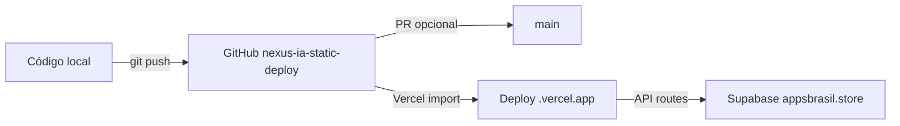

# Configurar GitHub e Deploy — Nexus IA

Guia completo para publicar, abrir PR e conectar o projeto **Nexus Inteligência Artificial** ao GitHub e Vercel.

| Recurso | URL |
|---|---|
| **Repositório** | https://github.com/ivoneieletrotecnico-collab/151230 |
| **Branch de deploy** | `nexus-ia-static-deploy` |
| **Branch principal (remota)** | `main` |
| **Abrir PR** | https://github.com/ivoneieletrotecnico-collab/151230/pull/new/nexus-ia-static-deploy |

> Panorama rápido: `DEPLOY-STATUS.md` · Publicação resumida: `PUBLICAR-GITHUB.md` · MCP no Cursor: `CONFIGURAR-MCP-GITHUB.md`

---

## Status das branches (15/07/2026)

| Branch | Commit | Conteúdo |
|---|---|---|
| `nexus-ia-static-deploy` | `7d3701e` — *docs: status de deploy Nexus IA...* | Landing HTML estática Nexus IA + Vercel + Supabase |
| `main` | `dc33ff7` — *Fix homepage service card overflow* | Projeto React/Vite com painel admin (histórico diferente) |

A branch **`nexus-ia-static-deploy` já está publicada** no GitHub. O push direto para `main` foi rejeitado (sem force push) porque as duas versões divergem bastante.

### Estratégias possíveis

- **A) Deploy pela branch de feature (recomendado agora)** — Conecte o Vercel à `nexus-ia-static-deploy` sem mergear na `main`
- **B) Merge via PR** — Abra PR, resolva conflitos manualmente, depois deploy da `main`
- **C) Substituir `main`** — Só com backup; exigiria force push (**não recomendado**)

---

## Passo 1 — Pré-requisito Git (Windows / drive G:)

Se o Git reclamar de *"dubious ownership"*:

```powershell
git config --global --add safe.directory "G:/Videos e matriais/Arsenal/Projeto page"
```

Alternativa sem alterar config global:

```powershell
git -c safe.directory="G:/Videos e matriais/Arsenal/Projeto page" status
```

---

## Passo 2 — Autenticação GitHub

### Status nesta máquina

| Ferramenta | Status |
|---|---|
| `gh` CLI | Instalado (v2.86.0) |
| `gh auth` | **Não logado** — precisa autenticar |
| Git push HTTPS | Funciona com PAT como senha |

### Opção A — `gh auth login` (recomendado)

```powershell
gh auth login
```

1. Escolha **GitHub.com**
2. Protocolo: **HTTPS**
3. Autentique via **navegador** ou cole um **Personal Access Token**
4. Confirme:

```powershell
gh auth status
```

### Opção B — Token PAT no push Git (sem gh)

1. Crie token em https://github.com/settings/tokens
2. Escopo: `repo`
3. No `git push`, use seu usuário GitHub e o **token como senha**

### Opção C — SSH

```powershell
git remote set-url origin git@github.com:ivoneieletrotecnico-collab/151230.git
```

Requer chave SSH configurada em https://github.com/settings/keys

---

## Passo 3 — Abrir Pull Request

### Via navegador (funciona sem gh)

1. Abra: https://github.com/ivoneieletrotecnico-collab/151230/pull/new/nexus-ia-static-deploy
2. Base: `main` ← Compare: `nexus-ia-static-deploy`
3. Título sugerido: **Nexus IA: landing estática com Vercel e Supabase**
4. Descrição sugerida:

```markdown
## Resumo
- Landing page estática Nexus IA (HTML/CSS/JS)
- Build Vercel (`npm run build` → `dist/`)
- API serverless + integração Supabase (appsbrasil.store)

## Test plan
- [ ] Preview Vercel da branch
- [ ] Formulário de contato salva no Supabase
- [ ] Downloads listam corretamente
- [ ] WhatsApp e dados de contato corretos
```

5. Clique em **Create pull request**
6. Revise conflitos — muitos arquivos podem divergir da `main` React/Vite

### Via `gh` CLI (após `gh auth login`)

```powershell
cd "g:\Videos e matriais\Arsenal\Projeto page"

gh pr create `
  --repo ivoneieletrotecnico-collab/151230 `
  --base main `
  --head nexus-ia-static-deploy `
  --title "Nexus IA: landing estática com Vercel e Supabase" `
  --body "Landing HTML estática, build Vercel e API Supabase. Ver CONFIGURAR-GITHUB.md."
```

Listar PRs existentes:

```powershell
gh pr list --repo ivoneieletrotecnico-collab/151230
```

---

## Passo 4 — Enviar novas alterações

```powershell
cd "g:\Videos e matriais\Arsenal\Projeto page"

git add .
git commit -m "Nexus IA: atualização deploy"
git push origin HEAD:nexus-ia-static-deploy
```

> O comando acima envia a branch local atual para `nexus-ia-static-deploy` no remoto, mesmo que localmente você esteja em `main`.

Identidade Git (se commits falharem por autor):

```powershell
git config user.email "ivonei.energia@gmail.com"
git config user.name "Ivonei Eletricista"
```

---

## Passo 5 — Conectar Vercel ao GitHub

### Importar o repositório

1. Acesse https://vercel.com/new
2. **Import Git Repository** → conecte conta GitHub se pedido
3. Selecione `ivoneieletrotecnico-collab/151230`
4. **Branch:** `nexus-ia-static-deploy` (ou `main` após merge da PR)

### Configuração de build

O projeto já inclui `vercel.json`:

| Campo | Valor |
|---|---|
| Framework | Other |
| Build Command | `npm run build` |
| Output Directory | `dist` |
| Clean URLs | `true` |

Na tela de import do Vercel, confirme que bate com os valores acima (o `vercel.json` preenche automaticamente).

### Variáveis de ambiente (obrigatório para API)

Em **Project Settings → Environment Variables**:

| Variável | Valor |
|---|---|
| `SUPABASE_URL` | `https://supabase.appsbrasil.store` |
| `SUPABASE_SERVICE_ROLE_KEY` | sua chave `service_role` |
| `SUPABASE_DOWNLOADS_TABLE` | `downloads` |
| `SUPABASE_CONTACT_REQUESTS_TABLE` | `contact_requests` |

Guia Supabase completo: `CONFIGURAR-SUPABASE-APPSBRASIL.md`

### Deploy

1. Clique **Deploy**
2. Aguarde o build (`npm run build`)
3. Acesse a URL `.vercel.app` gerada
4. Teste:
   - Página inicial carrega
   - `POST /api/contact-requests` (formulário)
   - `GET /api/downloads`

### Deploy contínuo

Após conectar, cada push na branch configurada dispara novo deploy automaticamente.

---

## Passo 6 — Validar localmente antes do deploy

```powershell
cd "g:\Videos e matriais\Arsenal\Projeto page"

npm install
npm run build          # gera dist/
npm run preview        # serve dist/ localmente
npm run dev            # dev server em http://localhost:3000
```

Supabase (após preencher `.env`):

```powershell
npm run supabase:test
npm run supabase:migrate
```

---

## Passo 7 — Habilitar GitHub MCP no Cursor (opcional)

Para o agente criar PRs, listar branches e gerenciar issues pelo chat:

Siga `CONFIGURAR-MCP-GITHUB.md` — resumo: adicione o servidor `github` em `C:\Users\User\.cursor\mcp.json` com seu PAT.

---

## Fluxo visual



---

## Problemas comuns

| Problema | Solução |
|---|---|
| `dubious ownership` | `safe.directory` (Passo 1) |
| `gh` não autenticado | `gh auth login` ou use PR pelo navegador |
| Push rejeitado na `main` | Use `nexus-ia-static-deploy` ou abra PR |
| Vercel build falha | Rode `npm run build` local; verifique Node 18+ |
| API 500 no Vercel | Variáveis Supabase ausentes no painel Vercel |
| Conflitos na PR | Resolva no GitHub ou localmente com `git merge origin/main` |
| Token exposto | Revogue em GitHub Settings; nunca commite `.env` |

---

## Checklist rápido

- [ ] Branch `nexus-ia-static-deploy` visível no GitHub
- [ ] PR aberta (navegador ou `gh pr create`)
- [ ] `SUPABASE_SERVICE_ROLE_KEY` no `.env` local
- [ ] `npm run supabase:test` passou
- [ ] Repositório importado no Vercel
- [ ] Branch `nexus-ia-static-deploy` selecionada no Vercel
- [ ] Variáveis Supabase no Vercel
- [ ] Deploy concluído e site testado
- [ ] (Opcional) GitHub MCP configurado no Cursor

---

## Comandos úteis

```powershell
cd "g:\Videos e matriais\Arsenal\Projeto page"

# Status
git -c safe.directory="G:/Videos e matriais/Arsenal/Projeto page" status

# Ver branches remotas
git ls-remote --heads origin

# Abrir repo no navegador
gh repo view ivoneieletrotecnico-collab/151230 --web

# Ver último commit da branch de deploy (API pública)
# https://api.github.com/repos/ivoneieletrotecnico-collab/151230/branches/nexus-ia-static-deploy
```

---

## Arquivos sensíveis

- `.env` está no `.gitignore` — **nunca** commitar chaves
- PAT do GitHub e `SUPABASE_SERVICE_ROLE_KEY` só em ambiente local e Vercel
- `.env.example` é o template seguro para o repositório
